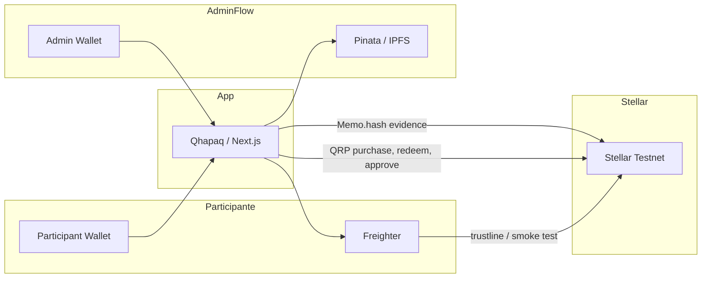

[🇪🇸 Español](README.md) | 🇺🇸 English

# Qhapaq

> Digital infrastructure that makes participation in real-world projects more transparent and verifiable.

Qhapaq connects a real-world project in the MVP, **Huaral Resort**, with digital records on **Stellar Testnet**. Participation is expressed as **QRP**, benefits can be generated and checked, and progress milestones are approved together with evidence stored on IPFS.

Relevant operations leave a **transaction hash** you can open in Stellar Explorer.

[](https://stellar.org)
[](https://nextjs.org)
[](https://www.typescriptlang.org)
[](https://www.pinata.cloud)
[](https://www.freighter.app)
[](LICENSE)

---

## The problem

Real-world projects can offer participation, benefits, and progress commitments. In practice, it is often hard to:

- Follow progress clearly
- Look up records consistently
- Verify evidence tied to a milestone
- Keep digital records traceable
- Confirm that an operation was actually recorded

This is not framed as fraud. It is a gap in **transparency, traceability, and verifiability** in one place.

---

## The solution

**Qhapaq** is digital infrastructure that links a real-world project to verifiable records.

In the MVP, the example is **Huaral Resort** (Huaral, Lima): a coastal hotel project. A participant can acquire digital participation measured in **QRP**, check their balance, generate a benefit (20% off resort services), and review milestone progress with evidence.

| Concept                | Role in Qhapaq                                                           |
| ---------------------- | ------------------------------------------------------------------------ |
| Real-world project     | Huaral Resort — MVP use case                                             |
| Digital representation | Project page, funding, milestones, and benefits                          |
| **QRP**                | Stellar Classic Asset representing project-defined digital participation |
| **Stellar**            | Public settlement layer for operations and proofs                        |
| **Milestones**         | Commitments / progress whose status is recorded with evidence            |
| **IPFS (Pinata)**      | Storage for evidence files                                               |
| **Benefits**           | How participation-linked benefits are materialized                       |

**MVP scope:** a verifiable-participation demo on Testnet. Qhapaq does not issue legal titles and does not physically verify construction work.

---

## RWA approach

In Qhapaq, **Real World Assets (RWA)** means creating a link between elements of a real-world project and digital infrastructure that lets people **query and verify records**.

```text
Real-world project (Huaral Resort)
        ↓
Digital representation in Qhapaq
        ↓
QRP (digital participation)
        ↓
Stellar Testnet (operations + proofs)
        ↓
Participation + benefits + verifiable records
```

---

## How does Qhapaq use Stellar?

Stellar is Qhapaq’s **public, verifiable record layer**. Relevant MVP operations produce real transactions on **Stellar Testnet**, with hashes viewable on [Stellar Expert](https://stellar.expert/explorer/testnet).

### QRP as a Stellar Classic Asset

- **Code:** `QRP`
- **Type:** Stellar Classic Asset (Horizon / `stellar-sdk`)
- **Issuer:** account configured via `NEXT_PUBLIC_QRP_ISSUER`
- **Explorer (Testnet):** [QRP on Stellar Expert](https://stellar.expert/explorer/testnet/asset/QRP-GBZDZVXIZQXKL5LRGB4CHOCXHMVEDY4ERP3B26KFLBIIYCO2CL5TXSR3)
- The asset is already issued on Testnet; the app does not recreate it
- QRP balances are read from Horizon

### What gets recorded on Stellar

| Operation                 | On-chain behavior                                            | Who signs                       |
| ------------------------- | ------------------------------------------------------------ | ------------------------------- |
| QRP trustline             | `changeTrust` toward the QRP issuer                          | **Participant** (Freighter)     |
| Participation acquisition | QRP payment: Distributor → Participant (memo `Qhapaq QRP`)   | **Server** (Distributor secret) |
| Milestone approval        | `0.0001` XLM self-payment + `Memo.hash(SHA-256 of evidence)` | **Server** (Admin secret)       |
| Benefit use               | `0.0001` XLM self-payment + memo with Benefit ID             | **Server** (Redemption secret)  |
| Wallet smoke test         | Minimal XLM self-payment (portfolio)                         | **Participant** (Freighter)     |

### Why Stellar matters

1. Every QRP acquisition leaves a public **transaction hash**.
2. Every milestone approval anchors the evidence **SHA-256 hash** in an on-chain memo.
3. Every benefit use leaves a **proof** tied to the Benefit ID.
4. Anyone can open the explorer and compare it with what the UI shows.

---

## Wallets

Wallets are separated by operational role. That limits each key’s blast radius and makes clear who records each kind of proof.

| Wallet                 | Role                                                                                                             |
| ---------------------- | ---------------------------------------------------------------------------------------------------------------- |
| **Participant Wallet** | User wallet (Freighter). Connects, creates the trustline, receives QRP, generates benefits, and checks balances. |
| **Distributor Wallet** | Sends QRP to the participant when they acquire participation. Signs on the server.                               |
| **Admin Wallet**       | Identifies the admin in the UI and signs the on-chain milestone-approval proof.                                  |
| **Redemption Wallet**  | Records the on-chain proof when a benefit is marked as used. Does not move QRP.                                  |

Secret keys (`QHAPAQ_*_SECRET_KEY`) live only on the server. They are never exposed to the frontend or the repository.

---

## Live proof on Stellar Testnet

Primary demo transaction — a real QRP transfer between wallets on Stellar Testnet, used by Qhapaq to record digital participation:

|              |                                                                                                                                                 |
| ------------ | ----------------------------------------------------------------------------------------------------------------------------------------------- |
| **Hash**     | `43070e06f0ae006e5ebc3357f06d15690cf83087438b5d143a8d2bd895061924`                                                                              |
| **Explorer** | [View on Stellar Expert (Testnet)](https://stellar.expert/explorer/testnet/tx/43070e06f0ae006e5ebc3357f06d15690cf83087438b5d143a8d2bd895061924) |

> This transaction shows a real QRP transfer between wallets on Stellar Testnet, used by Qhapaq to record digital participation.

From the app, every successful operation also surfaces its own explorer link.

---

## How it works

### Participant flow

1. Connect a wallet with **Freighter** (Stellar Testnet).
2. Explore **Huaral Resort** on the home page.
3. Add the QRP trustline (signed in Freighter) and acquire / receive participation: the **Distributor** sends QRP on-chain.
4. Check participation (QRP balance) and funding progress derived from Horizon.
5. Open **Benefits** if they hold at least 1 QRP (or are admin).
6. **Generate** a benefit (e.g. 20% discount): creates a Benefit ID (`QHP-XXXXXX`) and a QR code.
7. **Verify** the benefit on the verify screen (same session).
8. **Use** the benefit: a Stellar proof is recorded via the Redemption Wallet.
9. Open the corresponding public hash in Stellar Explorer.

### Admin flow

1. The administrator connects the **Admin Wallet** (address = `NEXT_PUBLIC_QRP_ADMIN`).
2. Opens the **Admin** dashboard and reviews milestones.
3. Selects a pending milestone and attaches evidence (PDF or image + description).
4. Evidence is uploaded to **Pinata → IPFS** (CID + metadata).
5. The file’s **SHA-256** is computed.
6. The milestone is approved only **after** a successful Stellar transaction (`Memo.hash` of the content).
7. Participants can review status, evidence (IPFS gateway), and the explorer link.

---

## Evidence and IPFS

Stellar does **not** store PDFs or images. The split is intentional:

```text
Admin
  ↓
Uploads PDF / image (≤ 10 MB)
  ↓
Pinata
  ↓
IPFS (CID)
  ↓
File SHA-256
  ↓
Reference / hash recorded on Stellar (Memo.hash)
```

| Layer             | What it stores                                          | Why                                         |
| ----------------- | ------------------------------------------------------- | ------------------------------------------- |
| **IPFS (Pinata)** | File + metadata (milestone, description, `contentHash`) | Locate evidence via CID / gateway           |
| **Stellar**       | Memo with SHA-256 + minimal XLM proof                   | Publicly anchor _which_ file was associated |

Evidence shows **which file was tied to the record**.

---

## Benefits

Actionable MVP benefit: **20% discount** on resort services (`huaral-resort-20-off`).

| Step         | What Qhapaq does                                                |
| ------------ | --------------------------------------------------------------- |
| Eligibility  | Admin, or participant with ≥ 1 QRP                              |
| Generate     | Benefit ID `QHP-` + 6 characters; QR with JSON payload          |
| Verify       | Lookup in the current session (client in-memory state)          |
| Use / redeem | `POST /api/benefits/redeem` → Stellar proof (memo = Benefit ID) |

---

## Architecture

### Stack (actually used)

| Layer      | Technology                                         |
| ---------- | -------------------------------------------------- |
| App        | Next.js 16, React 19, TypeScript                   |
| UI         | Tailwind CSS 4, shadcn/ui                          |
| i18n       | next-intl (`es` default, `en`)                     |
| Wallet     | Freighter (`@stellar/freighter-api`)               |
| Blockchain | Stellar Classic + Horizon (`stellar-sdk`), Testnet |
| Evidence   | Pinata SDK → IPFS                                  |
| Asset      | QRP (Classic Asset)                                |

### Diagram



### Main routes

| Route                       | Description                                             |
| --------------------------- | ------------------------------------------------------- |
| `/{locale}`                 | Huaral Resort project, funding, milestones, participate |
| `/{locale}/benefits`        | Generate / view benefits                                |
| `/{locale}/benefits/verify` | Verify and use a benefit                                |
| `/{locale}/admin`           | Milestone dashboard (Admin Wallet)                      |
| `/{locale}/portfolio`       | QRP balance and wallet smoke test                       |
| `/{locale}/profile`         | Profile via wallet menu                                 |

### API (server-side)

| Method | Endpoint                        | Role                                 |
| ------ | ------------------------------- | ------------------------------------ |
| `POST` | `/api/participation/purchase`   | Distributes QRP (Distributor signs)  |
| `GET`  | `/api/funding/progress`         | Raised funding from Horizon          |
| `GET`  | `/api/milestones`               | List + Pinata/Horizon reconciliation |
| `POST` | `/api/admin/milestones/approve` | IPFS upload + Admin Stellar proof    |
| `POST` | `/api/benefits/redeem`          | Redemption Stellar proof             |

---

## Security

Mechanisms present in the code:

- Secret keys **server-side only** (`QHAPAQ_DISTRIBUTOR_SECRET_KEY`, `QHAPAQ_ADMIN_SECRET_KEY`, `QHAPAQ_REDEMPTION_SECRET_KEY`)
- Public variables (`NEXT_PUBLIC_*`) limited to network, issuer, distributor, and admin **public** keys
- Freighter signs user operations (trustline, smoke test)
- Operational wallets separated by role
- Secrets not committed to the repository (see `.env.example` in `qhapaq/`)
- Each secret is checked against the expected public key before signing

---

## MVP scope

### Implemented

- Freighter wallet connect (Testnet)
- QRP as Classic Asset: trustline, balance, on-chain distribution
- Participation acquisition with Stellar Explorer hash
- Funding progress from Distributor QRP payments (Horizon)
- Portfolio / profile with balances
- 20% benefit: generate, verify (session), use with Stellar proof
- Admin: milestones, evidence upload (PDF/image), Pinata/IPFS, SHA-256, on-chain approval
- Milestone reconciliation with Pinata + Horizon
- Full ES / EN i18n
- Light / dark theme

### Next steps (not implemented)

- Attestations or external verifiers of real-world facts
- Formal mainnet deployment (today: Testnet)
- Soroban contracts (out of current scope)

---

## Hackathon prototype

- Qhapaq runs on **Stellar Testnet**.
- QRP represents **digital participation** within the MVP.
- In production, authorized entities, audits, attestations, or other trusted sources could be used to corroborate real-world facts.

---

## Demo

**Live app:** [https://qhapaq-kappa.vercel.app/](https://qhapaq-kappa.vercel.app/)

To try locally:

```bash
cd qhapaq
cp .env.example .env   # fill variables (do not commit secrets)
pnpm install
pnpm dev
```

Open [http://localhost:3000](http://localhost:3000) (default locale: `/es`).

### Functions of Qhapaq

1. Connect Freighter on Testnet
2. Explore Huaral Resort and funding / milestone progress
3. Create a trustline, acquire participation, and open the hash on Stellar Expert
4. Generate, verify, and use the 20% benefit
5. (Admin) Upload evidence, approve a milestone, and open CID + tx in the explorer

### Environment variables (names)

See `qhapaq/.env.example`. Public: Stellar network, QRP issuer, distributor, admin, Pinata gateway. Private (server): Distributor, Admin, and Redemption secrets; `PINATA_JWT`.

---

## Repository structure

```text
qhapaq/                 # Next.js application
  app/                  # App Router + API routes
  components/           # UI (project, benefits, admin, wallet…)
  lib/stellar/          # Horizon, QRP, purchase, milestones, redemption
  lib/pinata/           # evidence upload
  lib/benefits/         # benefit definitions and flows
  lib/milestones/       # data, evidence, approval
  messages/             # i18n es / en
LICENSE
README.md               # Spanish
README.en.md            # this document (EN)
```

---

## License

[MIT](LICENSE) © 2026 Gianella Coronel
