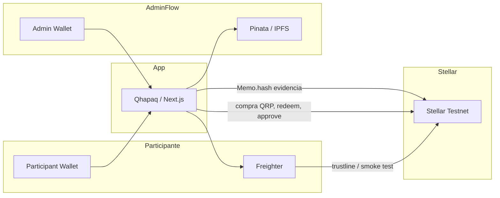

🇪🇸 Español | [🇺🇸 English](README.en.md)

# Qhapaq

> Infraestructura digital para hacer más transparente y verificable la participación en proyectos reales.

Qhapaq conecta un proyecto del mundo real en el MVP, **Huaral Resort**, con registros digitales en **Stellar Testnet**. La participación se expresa en **QRP**, los beneficios se generan y pueden comprobarse, y los hitos de avance se aprueban junto a evidencias almacenadas en IPFS.

Las operaciones relevantes dejan un **hash de transacción** consultable en Stellar Explorer.

[](https://stellar.org)
[](https://nextjs.org)
[](https://www.typescriptlang.org)
[](https://www.pinata.cloud)
[](https://www.freighter.app)
[](LICENSE)

---

## El problema

Los proyectos del mundo real pueden ofrecer participación, beneficios y compromisos de avance. En la práctica, suele ser difícil:

- Dar seguimiento al progreso de forma clara
- Consultar registros de forma consistente
- Verificar evidencias asociadas a un hito
- Mantener trazabilidad entre lo digital y lo ocurrido
- Comprobar que una operación realmente quedó registrada

El problema no es solo “falta de confianza”. Es **falta de transparencia, trazabilidad y verificabilidad** en un mismo lugar.

---

## La solución

**Qhapaq** es una infraestructura digital que vincula un proyecto del mundo real con registros verificables.

En el MVP, el ejemplo es **Huaral Resort** (Huaral, Lima): un proyecto de hotelería costera. El participante puede adquirir participación digital medida en **QRP**, consultar su balance, generar un beneficio (20% de descuento en servicios del resort) y revisar el avance de hitos con evidencias.

| Concepto                | Rol en Qhapaq                                                                          |
| ----------------------- | -------------------------------------------------------------------------------------- |
| Proyecto del mundo real | Huaral Resort — caso de uso del MVP                                                    |
| Representación digital  | Página del proyecto, funding, hitos y beneficios                                       |
| **QRP**                 | Stellar Classic Asset que representa la participación digital definida por el proyecto |
| **Stellar**             | Capa de registro público de operaciones y pruebas                                      |
| **Hitos**               | Compromisos / progreso cuyo estado se registra con evidencia                           |
| **IPFS (Pinata)**       | Almacenamiento de archivos de evidencia                                                |
| **Benefits**            | Materialización del beneficio asociado a la participación                              |

**Alcance del MVP:** demo de participación verificable en Testnet. Qhapaq no emite títulos legales ni verifica físicamente una obra de construcción.

---

## Enfoque RWA

En Qhapaq, **Real World Assets (RWA)** significa crear un vínculo entre elementos de un proyecto del mundo real y una infraestructura digital que permita **consultar y verificar registros**.

```text
Proyecto del mundo real (Huaral Resort)
        ↓
Representación digital en Qhapaq
        ↓
QRP (participación digital)
        ↓
Stellar Testnet (operaciones + pruebas)
        ↓
Participación + beneficios + registros verificables
```

---

## ¿Cómo utiliza Qhapaq Stellar?

Stellar es la **capa de registro público y verificable** de Qhapaq. Las operaciones relevantes del MVP producen transacciones reales en **Stellar Testnet**, con hash consultable en [Stellar Expert](https://stellar.expert/explorer/testnet).

### QRP como Stellar Classic Asset

- **Código:** `QRP`
- **Tipo:** Stellar Classic Asset (Horizon / `stellar-sdk`)
- **Emisor:** cuenta configurada mediante `NEXT_PUBLIC_QRP_ISSUER`
- **Explorer (Testnet):** [QRP en Stellar Expert](https://stellar.expert/explorer/testnet/asset/QRP-GBZDZVXIZQXKL5LRGB4CHOCXHMVEDY4ERP3B26KFLBIIYCO2CL5TXSR3)
- El activo ya está emitido en Testnet; la app no lo recrea
- Los balances de QRP se leen desde Horizon

### Qué se registra en Stellar

| Operación                    | Qué ocurre on-chain                                                 | Quién firma                       |
| ---------------------------- | ------------------------------------------------------------------- | --------------------------------- |
| Trustline QRP                | `changeTrust` hacia el emisor de QRP                                | **Participante** (Freighter)      |
| Adquisición de participación | Pago de QRP: Distributor → Participant (memo `Qhapaq QRP`)          | **Servidor** (Distributor secret) |
| Aprobación de hito           | Self-payment de `0.0001` XLM + `Memo.hash(SHA-256 de la evidencia)` | **Servidor** (Admin secret)       |
| Uso de beneficio             | Self-payment de `0.0001` XLM + memo con Benefit ID                  | **Servidor** (Redemption secret)  |
| Smoke test de wallet         | Self-payment mínimo de XLM (portfolio)                              | **Participante** (Freighter)      |

### Por qué importa Stellar

1. Cada adquisición de QRP deja un **transaction hash** público.
2. Cada aprobación de hito ancla el **hash SHA-256** de la evidencia en un memo on-chain.
3. Cada uso de beneficio deja una **prueba** asociada al Benefit ID.
4. Cualquiera puede abrir el explorer y contrastar lo que muestra la UI.

---

## Wallets

Las wallets están separadas por rol operativo. Así se limita el alcance de cada clave y se deja claro quién registra cada tipo de prueba.

| Wallet                 | Función                                                                                                     |
| ---------------------- | ----------------------------------------------------------------------------------------------------------- |
| **Participant Wallet** | Wallet del usuario (Freighter). Conecta, crea trustline, recibe QRP, genera beneficios y consulta balances. |
| **Distributor Wallet** | Distribuye QRP al participante al adquirir participación. Firma en el servidor.                             |
| **Admin Wallet**       | Identifica al administrador en la UI y firma la prueba on-chain de aprobación de hitos.                     |
| **Redemption Wallet**  | Registra la prueba on-chain cuando un beneficio se marca como utilizado. No mueve QRP.                      |

Las secret keys (`QHAPAQ_*_SECRET_KEY`) viven solo en el servidor. Nunca se exponen al frontend ni al repositorio.

---

## Prueba real en Stellar Testnet

Transacción principal de demostración — transferencia real de QRP entre wallets en Stellar Testnet, utilizada por Qhapaq para registrar la participación digital:

|              |                                                                                                                                                |
| ------------ | ---------------------------------------------------------------------------------------------------------------------------------------------- |
| **Hash**     | `43070e06f0ae006e5ebc3357f06d15690cf83087438b5d143a8d2bd895061924`                                                                             |
| **Explorer** | [Ver en Stellar Expert (Testnet)](https://stellar.expert/explorer/testnet/tx/43070e06f0ae006e5ebc3357f06d15690cf83087438b5d143a8d2bd895061924) |

> Esta transacción demuestra una transferencia real de QRP entre wallets en Stellar Testnet, utilizada por Qhapaq para registrar la participación digital.

Desde la app, cada operación exitosa también muestra su propio enlace al explorer.

---

## ¿Cómo funciona?

### Flujo del participante

1. Conecta su wallet con **Freighter** (Stellar Testnet).
2. Explora **Huaral Resort** en la página principal.
3. Agrega la trustline de QRP (firma en Freighter) y adquiere / recibe participación: el **Distributor** envía QRP on-chain.
4. Consulta su participación (balance QRP) y el progreso de funding derivado de Horizon.
5. Accede a **Beneficios** si tiene al menos 1 QRP (o es admin).
6. **Genera** un beneficio (p. ej. 20% de descuento): se crea un Benefit ID (`QHP-XXXXXX`) y un QR.
7. **Verifica** el beneficio en la pantalla de verificación (misma sesión).
8. **Utiliza** el beneficio: se registra una prueba en Stellar vía Redemption Wallet.
9. Consulta el hash público correspondiente en Stellar Explorer.

### Flujo administrativo

1. El administrador conecta el **Admin Wallet** (dirección = `NEXT_PUBLIC_QRP_ADMIN`).
2. Abre el panel **Admin** y consulta los hitos.
3. Selecciona un hito pendiente y agrega evidencia (PDF o imagen + descripción).
4. La evidencia se sube a **Pinata → IPFS** (CID + metadata).
5. Se calcula el **SHA-256** del archivo.
6. Se aprueba el hito solo **después** de una transacción exitosa en Stellar (`Memo.hash` del contenido).
7. El participante puede consultar estado, evidencia (gateway IPFS) y el enlace al explorer.

---

## Evidencias e IPFS

Stellar **no** almacena PDFs ni imágenes. La separación es intencional:

```text
Admin
  ↓
Sube PDF / imagen (≤ 10 MB)
  ↓
Pinata
  ↓
IPFS (CID)
  ↓
SHA-256 del archivo
  ↓
Referencia / hash registrado en Stellar (Memo.hash)
```

| Capa              | Qué guarda                                            | Para qué sirve                                              |
| ----------------- | ----------------------------------------------------- | ----------------------------------------------------------- |
| **IPFS (Pinata)** | Archivo + metadata (hito, descripción, `contentHash`) | Localizar la evidencia vía CID / gateway                    |
| **Stellar**       | Memo con el hash SHA-256 + prueba mínima en XLM       | Anclar de forma pública e inmutable _qué_ archivo se asoció |

La evidencia demuestra **qué archivo quedó asociado al registro**.

---

## Beneficios

Beneficio accionable del MVP: **20% de descuento** en servicios del resort (`huaral-resort-20-off`).

| Paso          | Qué hace Qhapaq                                                  |
| ------------- | ---------------------------------------------------------------- |
| Elegibilidad  | Admin, o participante con ≥ 1 QRP                                |
| Generar       | Benefit ID `QHP-` + 6 caracteres; QR con payload JSON            |
| Verifica      | Lookup en la sesión actual (estado en memoria del cliente)       |
| Usar / redeem | `POST /api/benefits/redeem` → prueba Stellar (memo = Benefit ID) |

---

## Arquitectura

### Stack (realmente utilizado)

| Capa       | Tecnología                                         |
| ---------- | -------------------------------------------------- |
| App        | Next.js 16, React 19, TypeScript                   |
| UI         | Tailwind CSS 4, shadcn/ui                          |
| i18n       | next-intl (`es` por defecto, `en`)                 |
| Wallet     | Freighter (`@stellar/freighter-api`)               |
| Blockchain | Stellar Classic + Horizon (`stellar-sdk`), Testnet |
| Evidencias | Pinata SDK → IPFS                                  |
| Activo     | QRP (Classic Asset)                                |

### Diagrama



### Rutas principales

| Ruta                        | Descripción                                        |
| --------------------------- | -------------------------------------------------- |
| `/{locale}`                 | Proyecto Huaral Resort, funding, hitos, participar |
| `/{locale}/benefits`        | Generar / ver beneficios                           |
| `/{locale}/benefits/verify` | Verificar y usar beneficio                         |
| `/{locale}/admin`           | Dashboard de hitos (Admin Wallet)                  |
| `/{locale}/portfolio`       | Balance QRP y prueba de wallet                     |
| `/{locale}/profile`         | Perfil vía menú de wallet                          |

### API (server-side)

| Método | Endpoint                        | Rol                                   |
| ------ | ------------------------------- | ------------------------------------- |
| `POST` | `/api/participation/purchase`   | Distribuye QRP (firma Distributor)    |
| `GET`  | `/api/funding/progress`         | Funding levantado desde Horizon       |
| `GET`  | `/api/milestones`               | Lista + reconciliación Pinata/Horizon |
| `POST` | `/api/admin/milestones/approve` | Upload IPFS + prueba Admin en Stellar |
| `POST` | `/api/benefits/redeem`          | Prueba Redemption en Stellar          |

---

## Seguridad

Mecanismos presentes en el código:

- Secret keys **solo server-side** (`QHAPAQ_DISTRIBUTOR_SECRET_KEY`, `QHAPAQ_ADMIN_SECRET_KEY`, `QHAPAQ_REDEMPTION_SECRET_KEY`)
- Variables públicas (`NEXT_PUBLIC_*`) limitadas a red, issuer, distributor y admin **públicos**
- Freighter firma las operaciones del usuario (trustline, smoke test)
- Separación de wallets operativas por rol
- Secrets no incluidos en el repositorio (ver `.env.example` en `qhapaq/`)
- Validación de que cada secret corresponde a la public key esperada antes de firmar

---

## Alcance del MVP

### Implementado

- Conexión de wallet con Freighter (Testnet)
- QRP como Classic Asset: trustline, balance, distribución on-chain
- Adquisición de participación con hash en Stellar Explorer
- Funding progress calculado desde pagos QRP del Distributor (Horizon)
- Portfolio / perfil con balances
- Beneficio 20%: generar, verificar (sesión), usar con prueba Stellar
- Admin: hitos, upload de evidencia (PDF/imagen), Pinata/IPFS, SHA-256, aprobación on-chain
- Reconciliación de hitos con Pinata + Horizon
- i18n completo ES / EN
- Tema claro / oscuro

### Próximos pasos (no implementados)

- Attestations o verificadores externos de hechos del mundo real
- Despliegue formal en mainnet (hoy: Testnet)
- Contratos Soroban (fuera del alcance actual)

---

## Prototipo de hackathon

- Qhapaq funciona sobre **Stellar Testnet**.
- QRP representa **participación digital** dentro del MVP.
- En un entorno de producción podrían usarse entidades autorizadas, auditorías, attestations u otras fuentes confiables para contrastar hechos del mundo real.

---

## Demo

**App desplegada:** [https://qhapaq-kappa.vercel.app/](https://qhapaq-kappa.vercel.app/)

Para probar en local:

```bash
cd qhapaq
cp .env.example .env   # completar variables (sin commitear secrets)
pnpm install
pnpm dev
```

Abrir [http://localhost:3000](http://localhost:3000) (locale por defecto: `/es`).

### Funciones que cumple Qhapaq

1. Conectar Freighter en Testnet
2. Explorar Huaral Resort y el progreso de funding / hitos
3. Crear trustline, adquirir participación y ver el hash en Stellar Expert
4. Generar, verificar y usar el beneficio del 20%
5. (Admin) Subir evidencia, aprobar un hito y abrir CID + tx en explorer

### Variables de entorno (nombres)

Ver `qhapaq/.env.example`. Públicas: red Stellar, issuer QRP, distributor, admin, gateway Pinata. Privadas (servidor): secrets de Distributor, Admin y Redemption; `PINATA_JWT`.

> **Disclaimer:** Qhapaq is a hackathon prototype. QRP represents digital participation within the MVP and does not by itself constitute a legal ownership instrument, a securities offering, or a financial investment product.

---

## Estructura del repositorio

```text
qhapaq/                 # aplicación Next.js
  app/                  # App Router + API routes
  components/           # UI (proyecto, benefits, admin, wallet…)
  lib/stellar/          # Horizon, QRP, purchase, milestones, redemption
  lib/pinata/           # upload de evidencias
  lib/benefits/         # definición y flujos de beneficios
  lib/milestones/       # datos, evidencia, aprobación
  messages/             # i18n es / en
LICENSE
README.md               # este documento (ES)
README.en.md            # English
```

---

## Licencia

[MIT](LICENSE) © 2026 Gianella Coronel
